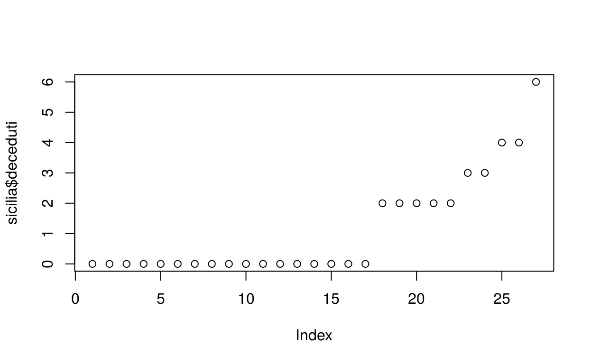

# COVID-19 : La situazione in Sicilia

<table>
 <thead>
  <tr>
   <th style="text-align:right;"> tamponi </th>
   <th style="text-align:right;"> nuovi_attualmente_positivi </th>
   <th style="text-align:right;"> totale_attualmente_positivi </th>
   <th style="text-align:right;"> isolamento_domiciliare </th>
   <th style="text-align:right;"> ricoverati_con_sintomi </th>
   <th style="text-align:right;"> terapia_intensiva </th>
  </tr>
 </thead>
<tbody>
  <tr>
   <td style="text-align:right;"> 4883 </td>
   <td style="text-align:right;"> 79 </td>
   <td style="text-align:right;"> 458 </td>
   <td style="text-align:right;"> 204 </td>
   <td style="text-align:right;"> 206 </td>
   <td style="text-align:right;"> 48 </td>
  </tr>
</tbody>
</table>

<table>
 <thead>
  <tr>
   <th style="text-align:right;"> tamponi_oggi </th>
   <th style="text-align:right;"> isolamento_domiciliare_oggi </th>
   <th style="text-align:right;"> ricoverati_con_sintomi_oggi </th>
   <th style="text-align:right;"> terapia_intensiva_oggi </th>
  </tr>
 </thead>
<tbody>
  <tr>
   <td style="text-align:right;"> 415 </td>
   <td style="text-align:right;"> 35 </td>
   <td style="text-align:right;"> 38 </td>
   <td style="text-align:right;"> 6 </td>
  </tr>
</tbody>
</table>

Ad oggi sono stati effettuati 4883 tamponi. Nelle ultime 24 ore ne sono stati effettuati 415.
I nuovi casi (positivi al tampone... link alla who per definizione di caso) sono 79. Rispetto al bilancio della giornata di ieri, il numero delle persone risultate positive al tampone in un solo giorno è aumentato (21 persone in più).

I pazienti positivi al COVID-19 in Sicilia oggi sono in totale 458. Le persone positive al coronavirus in isolamento domiciliare sono 204. 

Rispetto a ieri, sono 35 le persone in più in isolamento domiciliare. Il totale dei pazienti ospedalizzati è 254, rispetto alla giornata di ieri sono state ricoverate 44 in più. I pazienti ricoverati con sintomi sono 206. Esclusa la terapia intensiva, i ricoveri ospedalieri sono 38 in più rispetto a ieri. I pazienti ricoverati in terapia intensiva sono 48, 6 in più rispetto a ieri.

Nella giornata di oggi sono decedute 2 persone. Dall'inizio dell'epidemia sono decedute 6 persone. Il totale dei casi registrati di COVID-19 è 490.

